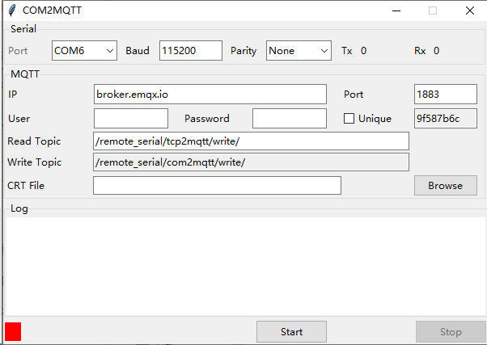
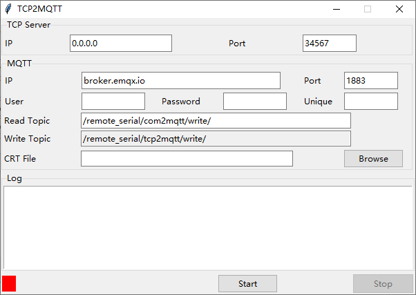
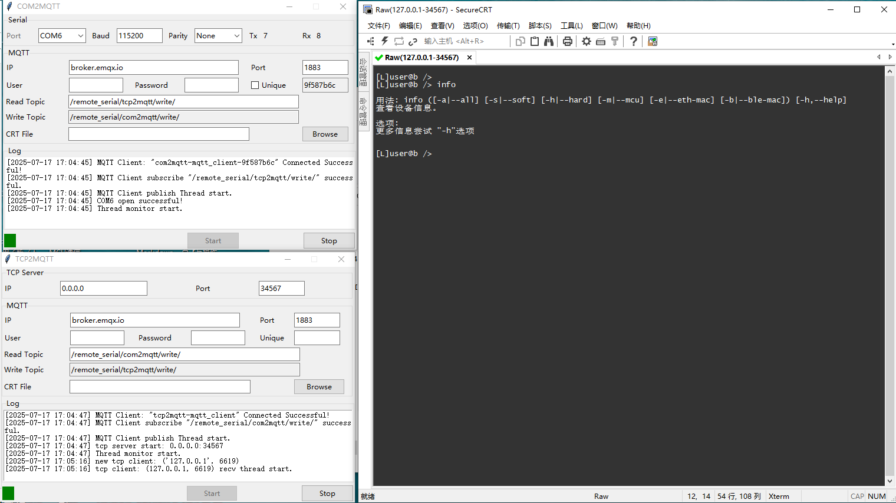

## 初衷

嵌入设备一般都用串口作为调试口，一般情况下只能在本地使用。现场维护时，软件工程师无法即时到达现场。通过互联网，把串口透明的转成TCP服务器，把远程串口变成本地服务器，这样不是可以解决串口远程通信的问题了吗？如此有了这个项目--- RemoteSerial。


## 原理

```
                                                +---------------+
                                                |               |
                             +------------------+  MQTT Broker  +-------------------+
                             |                  |               |                   |
                             |   +------------> +---------------+-------------+     |
                             |   |                                            |     |
                             |   |                                            |     |
                             v   |                                            |     v
                        +--------+---+                                     +--+---------+
+-----------+  Lan      |            |                                     |            |
| Tcp Client+-----------+            |                                     |            |   COM     +-------+
+-----------+           | TCP2MQTT   |                                     | COM2MQTT   +-----------+ Device|
                        |            |                +                    |            |           +-------+
                        +---+----+---+                                     +---+----+---+
                            +----+                                             +----+
```


COM2MQTT：连接设备的串口，数据通过MQTT转发。

TCP2MQTT：shell工具(如 SecureCRT )通过TCP连接到TCP2MQTT的TCP服务器，数据通过MQTT转发。

MQTT Broker：公共的免费MQTT Broker。


## 实现

COM2MQTT 和 TCP2MQTT 使用Python语言编写，使用Tkinter库实现GUI，UI设计工具是pygubu-designer。


COM2MQTT截图：



Unique：区分多个串口同时通信，多个串口同时通信必须勾选。MQTT Client ID，Read Topic，Write Topic 依赖此数据唯一标识。

TCP2MQTT 截图：



Unique：多个串口同时通信，复制COM2MQTT的Unique到此处。MQTT Client ID，Read Topic，Write Topic 依赖此数据唯一标识。

例子




发布

V1.0 版本

可执行文件打包在Bin目录中。